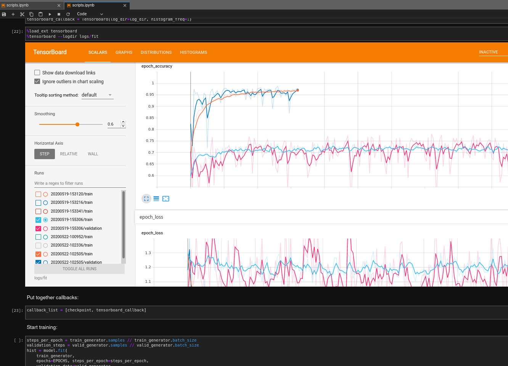
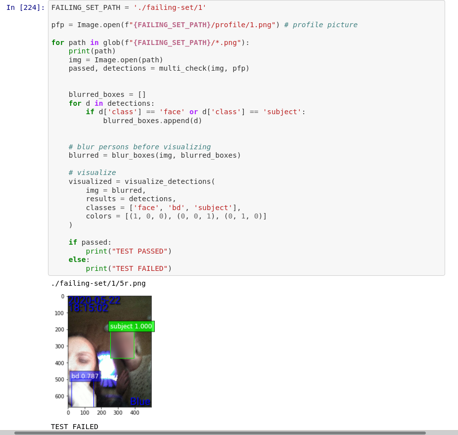
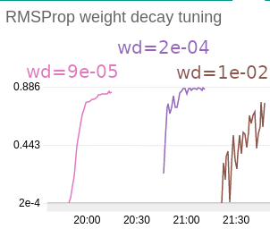
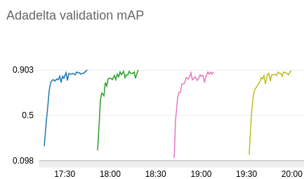

# legitimization-experiments
Neural network training graphs and inference results to go along with my thesis "Legitimizing monitored subjects using image recognition techniques"
The topic of the thesis concerns training and/or utilizing a set of prediction models including:
*  an image classifier for detecting the LED of breathalyzer devices
*  a custom object detector for detecting breathalyzers in a picture
*  face detection and recognition tools

## What's to see here?

A bunch of Jupyter notebooks and tensorboard graphs:

*  [color-inception-v3/scripts.ipynb](workspace/training_legitmization/color-inception-v3/scripts.ipynb) - Notebook and tensorboard logs for re-training [InceptionV3 architecture](https://keras.io/api/applications/inceptionv3/) in Keras.
*  [sagemaker-detections/detector-train.pynb](workspace/training_legitimization/sagemaker-detections/detector-train.pynb) - Notebook and script for re-training and tuning the [keras-retinanet detector](https://github.com/fizyr/keras-retinanet) in Keras.
*  [multi_check_test.ipynb](workspace/inference_legitimization/multi_check_test.ipynb) - Inference on a multi criteria check: detect faces, device, recognize subjects and verify device is used by the correct person.

## Launch it in jupyter
`build.sh`, `run.sh` - execute to build & run Jupyter docker image with dependencies.

## Previews
### Training color classifier (from TensorBoard):  

### Inference on multi criteria check (from Jupyter):  

### Adadelta, RMSProp optimizer graphs in hyperparameter tuning (from SageMaker):  

## Thesis: Legitimizing monitored subjects using image recognition techniques
I will add the link to my thesis as soon as it is publicly available on the university's server.
